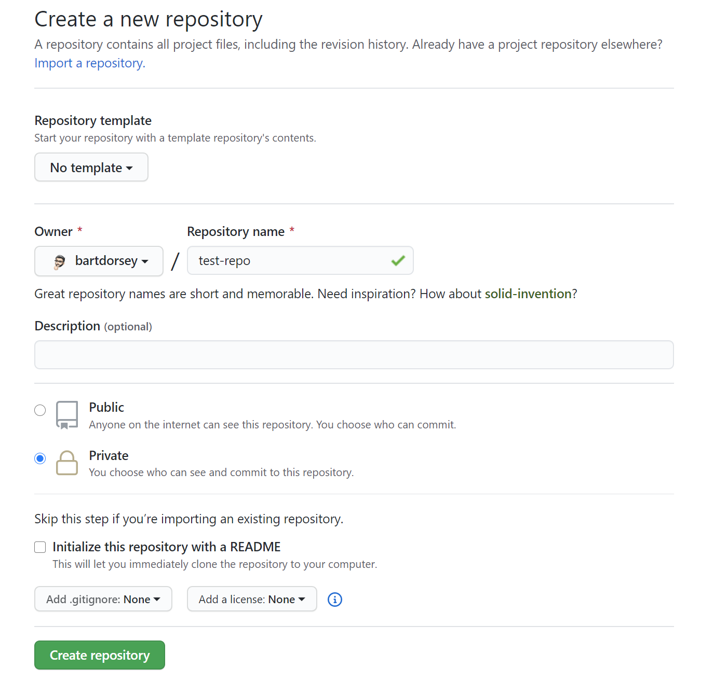

# Github workflow when given a starter repo

Create a new private repo on github.com.



Give your repository a descriptive name.

Make sure you don't check the `Initialize this repository with a README` and make sure `Add .gitignore` and `Add a license` are both set to `None`. 

If you are working on a project with a pair programming partner you can give them access to the private repo in github.com's Settings... Manage Access section. Then they can clone down a copy of the project as well.

## clone the starter repo and then immediately remove the `origin` remote

```shell
git clone <start repo clone url>
git remote remove origin
```

### Now you can add your own repo as the new origin and push your code

```shell
git remote add origin <your repo clone url>
git push -u origin master
```
