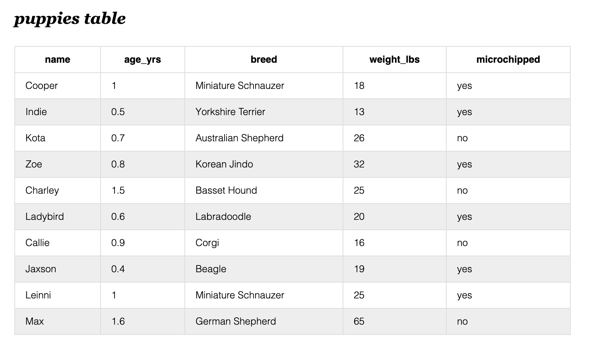

# W10D2
- INSERT 
- UPDATE 
- DELETE 
- Writing simple queries using SELECT 
- JOINING TABLES 

---
## The Videos
- What to pay attn to syntax / review of readings

---
## `INSERT`  
- Lets talk about `primary key` and `foreign keys`
    - primary key =>  the id of the row
    - foreign key =>  a column in a table that points to another row's primary id 

- Running the following code would `insert` those puppy items into our database, specifically `into` the table named `puppies`:

- Note the syntax: 

```sql
    INSERT into puppies
    values
    ('Cooper', 1, 'Miniature Schnauzer', 18, 'yes');

    INSERT into puppies
    values
    ('Indie', 0.5, 'Yorkshire Terrier', 13, 'yes'),
    ('Kota', 0.7, 'Australian Shepherd', 26, 'no'),
    ('Zoe', 0.8, 'Korean Jindo', 32, 'yes'),
    ('Charley', 1.5, 'Basset Hound', 25, 'no'),
    ('Ladybird', 0.6, 'Labradoodle', 20, 'yes'),
    ('Callie', 0.9, 'Corgi', 16, 'no'),
    ('Jaxson', 0.4, 'Beagle', 19, 'yes'),
    ('Leinni', 1, 'Miniature Schnauzer', 25, 'yes' ),
    ('Max', 1.6, 'German Shepherd', 65, 'no');
```


---

## `UPDATE`
 - Update allows you to edit existing data entries in your database. 
 - The example below shows three `update` statements:   
    - 1. Update the row in the friends table that has an `ID = 1` to now have its `puppy_id = 4` equal to 4.
    - 1. Repeat the above for a few more friends. 

- Syntax:
```sql
            UPDATE tablename
            SET column_name = x
            WHERE 
                column_name = y
```

---

## `DELETE`
```sql
DELETE FROM friends
WHERE id = 5
```

---

## `SELECT` 
- This clause is for picking specific columns 
- Use '*' to select everything (all rows) from a table. 

---
## Adding a foreign key reference

- You have two existing tables, `friends` and `puppies`. You want to add a reference
in your friends table to point to the puppy they own. How do we retroactively do so?

    1. add the foreign key
    2. update a record to now have a `puppy_id` value
    3. select all records from both tables, where the tables have the following criteria `puppies.id = friends.puppy_id`

* Note the syntax for adding a foreign key.

```sql 
    ALTER TABLE friends ADD 
    FOREIGN KEY (puppy_id) REFERENCES puppies (id); 


    UPDATE friends 
    SET puppy_id = 4
    WHERE id = 1;

    SELECT *
    FROM 
    puppies INNER JOIN friends ON puppies.id = friends.puppy_id
```

- Using update to populate the new `puppy_id` column: 


## JOIN 
- There are many types of joins => Inner, left outer, etc. 
- You should understand `INNER JOIN`. 
- In psql `JOIN` keyword defaults to an `INNER JOIN`. 


# W10D2 LO's :

1. How to use the `SELECT ... FROM ...` statement to select data from a single table
    - supply the column names in the select clause
    - supple the table(s) names in the from clause
        - if we want to select from more than one table, in order to accomplish this we must `JOIN`
          the other table(s). We use the ON clause to define how we want to join the additional table. 
    - ex:
        ```sql
            SELECT * 
            FROM friends JOIN puppies ON friends.puppy_id = puppies.id
        ```
    - Here, the `friends.puppy_id` is the FOREIGN KEY and the `puppies.id` is the primary key. 
    
1. How to use the `WHERE` clause on `SELECT, UPDATE, and DELETE` statements to narrow the scope of the command
    ```sql
        DELETE FROM tablename WHERE id = 5

        UPDATE tablename
        SET column_name = x
        WHERE column_name = y

        SELECT city, state, population_estimate_2018
        FROM cities
        WHERE city IN ('Phoenix', 'Jacksonville', 'Charlotte', 'Nashville');
    ```
1. How to use the `JOIN` keyword to join two (or more) tables together into a single virtual table

        ```sql
            SELECT 
                name, city 
            FROM 
                airports INNER JOIN cities ON (airports.city_id = cities.id);
        ```

1. How to use the `INSERT` statement to insert data into a table
    ```sql
        INSERT INTO puppies
        VALUES
        ('Cooper', 1, 'Miniature Schnauzer', 18, 'yes');
    ```
1. How to use an `UPDATE`and `DELETE` statement to update data in a table
    - `UPDATE tablename SET value `
    - `DELETE FROM tablename WHERE criteria `

1. How to use a seed file to populate data in a database

    1. Create a database 
        => CREATE DATABASE [databasename];
    2. Create a seeds file 
        => (solution from today's project)
    3. Pipe seeds file into database 
        => ` cat [path_to_file/file.sql] | psql -d [database] -U [username]`
